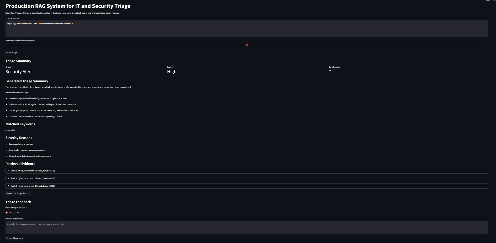
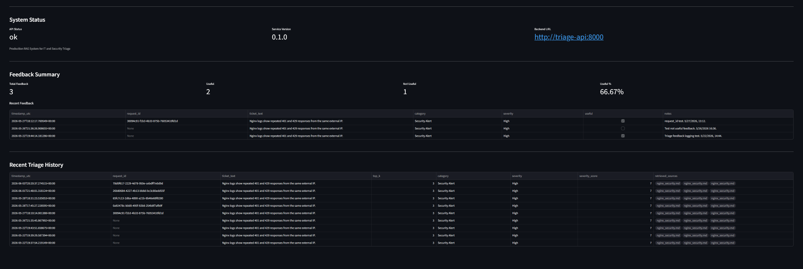
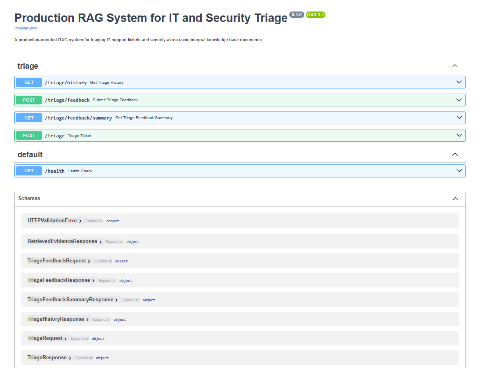

# Production RAG System for IT and Security Triage


A production-oriented AI backend system that uses retrieval-augmented generation concepts to triage IT support tickets and security alerts using internal documentation.

The system classifies tickets, calculates severity, retrieves relevant knowledge-base evidence, tracks requests with unique request IDs, captures human feedback, and exposes the workflow through FastAPI and a Streamlit dashboard.

## Purpose

This project demonstrates practical AI engineering and backend software development skills, including:

- Document ingestion and chunking
- Embedding generation with SentenceTransformers
- Vector search with FAISS
- Rule-based ticket classification
- Explainable severity scoring
- FastAPI backend development
- Structured API responses
- Optional API key protection for protected routes
- Unit testing with pytest
- Ruff linting and formatting
- Docker-based backend execution
- GitHub Actions CI
- Git/GitHub version control
- Production-oriented project organization
- Streamlit dashboard development
- Request history logging with request ID tracing
- Human feedback capture for triage evaluation
- Feedback summary metrics
- Docker Compose multi-service execution

## Current Status

The project currently supports an end-to-end local triage and feedback workflow:

```text
Ticket or alert text
    ↓
FastAPI triage request
    ↓
Unique request_id generation
    ↓
Rule-based or optional ML classification
    ↓
Severity scoring
    ↓
Knowledge-base retrieval
    ↓
Structured API response
    ↓
Streamlit dashboard display
    ↓
Human feedback capture
    ↓
Request and feedback logs
    ↓
Feedback summary metrics
```

Example input:

```text
Nginx logs show repeated 401 and 429 responses from the same external IP.
```

Example output:

```text
Category: Security Alert
Severity: High
Evidence: nginx_security.md
```

## Features Completed

- [x] Project structure and housekeeping
- [x] Local document ingestion
- [x] Text chunking with overlap
- [x] Sample IT/security knowledge-base documents
- [x] Embedding generation
- [x] Vector search with FAISS
- [x] End-to-end retriever
- [x] Ticket classification
- [x] Severity scoring
- [x] Triage service orchestration
- [x] FastAPI triage endpoint
- [x] Manual retrieval demo script
- [x] Manual API demo script
- [x] Evaluation metrics
- [x] Unit tests for core backend logic
- [x] Ruff linting and formatting
- [x] Docker support for the FastAPI backend
- [x] GitHub Actions CI
- [x] Streamlit dashboard
- [x] Docker Compose support for FastAPI and Streamlit
- [x] Request logging with local JSONL persistence
- [x] Request ID tracking across triage, history, and feedback
- [x] Feedback capture for human review
- [x] Feedback summary metrics
- [x] API health status display in dashboard
- [x] Streamlit dashboard history view
- [x] Downloadable Markdown triage reports
- [x] Deterministic triage summaries and recommended next steps
- [x] Expanded evaluation dataset with 16 labeled examples
- [x] Project screenshots for dashboard and API documentation
- [x] Optional API key protection for triage routes
- [x] Dashboard support for authenticated API requests
- [x] ML training dataset builder
- [x] Baseline ML category classifier training script
- [x] Optional ML category classifier integration
- [x] Classifier mode tracking in API responses

## Planned Features
- [ ] ML-based severity prediction using mapped public support datasets
- [ ] Optional LLM-generated triage summaries
- [ ] Cloud deployment
- [ ] Larger and more diverse evaluation dataset
- [ ] Role-based access control with user roles
- [ ] SLA risk and resolution-time prediction using structured incident metadata

## Engineering Standards

This project follows production-oriented Python software practices:

- Descriptive module, class, function, and variable names
- Type hints for function signatures
- Google-style docstrings for public modules, classes, and functions
- Clear separation between API routes, business logic, RAG logic, and evaluation logic
- Unit tests for core logic
- Explicit input validation and error handling
- No hardcoded secrets or credentials
- Local artifacts, virtual environments, logs, and secrets excluded from Git
- Deterministic baseline logic before adding LLM behavior
- Automated linting, formatting, and tests through GitHub Actions CI

## Architecture

```text
app/
├── api/
│   ├── routes_triage.py        # FastAPI triage route
│   └── security.py             # Optional API key authentication dependency
├── evaluation/
│   ├── evaluation_schemas.py   # Evaluation data structures
│   └── evaluator.py            # Evaluation metric calculations
├── ml/
│   └── category_classifier.py  # Optional ML category classifier wrapper
├── rag/
│   ├── chunking.py             # Text normalization and chunking
│   ├── document_loader.py      # Local document loading
│   ├── embeddings.py           # SentenceTransformer embedding wrapper
│   ├── knowledge_base.py       # Document-to-chunk preparation
│   ├── retriever.py            # End-to-end knowledge-base retriever
│   └── vector_store.py         # FAISS vector search
├── triage/
│   ├── classifier.py           # Rule-based ticket classification
│   ├── feedback_logger.py      # JSONL feedback logging and feedback summaries
│   ├── request_logger.py       # JSONL request history logging
│   ├── schemas.py              # Shared triage domain types
│   ├── service.py              # Triage workflow orchestration
│   ├── severity.py             # Explainable severity scoring
│   └── summary.py              # Deterministic summary and next-step generation
└── main.py                     # FastAPI application entry point

frontend/
└── streamlit_app.py            # Streamlit triage dashboard
```

## Knowledge Base Documents

Sample documents are stored in:

```text
data/docs/
```

Current sample documents include:

- `nginx_security.md`
- `password_reset.md`
- `shared_drive_access.md`
- `vpn_troubleshooting.md`

These documents simulate internal IT/security knowledge-base content used for retrieval.

## Setup

Create and activate a virtual environment:

```powershell
python -m venv .venv
.venv\Scripts\Activate.ps1
```

Install dependencies:

```powershell
pip install -r requirements.txt
```

## Run Tests

```powershell
pytest
```

At the current milestone, the test suite covers:

- Text chunking
- Document loading
- Knowledge-base preparation
- Embedding validation
- FAISS vector search
- Retrieval workflow
- Ticket classification
- Severity scoring
- Triage service orchestration
- FastAPI triage endpoint
- Evaluation utilities
- Request history endpoint
- Feedback submission endpoint
- Feedback summary endpoint
- Request ID tracking
- Optional API key authentication
- Dashboard API header generation
- Deterministic triage summaries
- Downloadable Markdown report generation
- Optional ML category classifier integration
- ML classifier fallback to rule-based classification 
- Classifier mode tracking in service and API responses

## Code Quality Checks

Run Ruff linting:

```powershell
ruff check .
```

Run Ruff formatting check:

```powershell
ruff format --check .
```

Apply Ruff formatting:

```powershell
ruff format .
```

Recommended local quality check before committing:

```powershell
ruff check .
ruff format --check .
pytest
```

## Evaluation

The project includes a labeled JSONL evaluation set and a local evaluation script.

Run evaluation:

```powershell
python -m scripts.run_evaluation
```

Current baseline results:

```text
category_accuracy: 100.00%
severity_accuracy: 100.00%
retrieval_hit_at_k: 100.00%
top_source_accuracy: 100.00%
```

Evaluation currently measures:

- Category classification accuracy
- Severity scoring accuracy
- Retrieval hit@k
- Top retrieved source accuracy

The evaluation dataset currently includes 16 labeled IT/security tickets covering security alerts, VPN/network access issues, shared drive access problems, authentication cases, and Nginx/web server events. The evaluation set is used to validate deterministic classification, explainable severity scoring, and retrieval quality as the project expands.

## Training Data

The planned ML classifier uses a hybrid training-data strategy that combines public support-ticket datasets with clearly labeled synthetic examples for underrepresented IT and security categories. The goal is to train and evaluate ticket classification and severity prediction models while keeping data provenance transparent.

Raw datasets are stored locally under:

```text
data/raw/
```

Raw external datasets are not committed to the repository. Generated training previews and model artifacts are also kept local and excluded from Git.

### Data Sources

#### Kaggle IT Support Ticket Dataset

The Kaggle IT Support Ticket Dataset provides labeled support-ticket records with ticket body text, department labels, priority labels, and tags. It is used as the primary public text source for early ticket-category and severity-model exploration.

Source:

```text
https://www.kaggle.com/datasets/suraj520/customer-support-ticket-dataset
```

#### Mendeley Help Desk Tickets

The Mendeley Help Desk Tickets dataset contains anonymized enterprise helpdesk data from an international software company, covering tickets reported between January 2016 and March 2023. It includes issue workflow data, priorities, resolution timing, and a curated sample of reporter/helpdesk utterances.

For this project, the reporter utterances are used selectively for text-classification exploration after filtering for public reporter messages. The structured issue data is also useful for future workflow and resolution-time modeling.

Source:

```text
https://data.mendeley.com/datasets/btm76zndnt/2
```

#### UCI ServiceNow Incident Management Event Log

The UCI ServiceNow Incident Management Event Log contains 141,712 event records covering 24,918 real incidents extracted from a ServiceNow platform used by an IT company. This dataset is not used for text classification because it does not include free-text ticket descriptions.

Instead, it is a strong candidate for a later structured ML feature, such as SLA-risk prediction, reassignment-risk prediction, or resolution-time prediction using incident metadata such as priority, impact, urgency, assignment group, reassignment count, and SLA status.

Source:

```text
https://archive.ics.uci.edu/dataset/498/incident+management+process+enriched+event+log
```

### Synthetic Augmentation

Some target categories are underrepresented or missing in the available public text datasets, especially:

- `Shared Drive / File Access`
- `Web Server / Nginx`

Synthetic examples will be added only to improve coverage for these underrepresented IT/security categories. Synthetic rows will be clearly marked with:

```text
is_synthetic: true
```

This keeps the training data honest and makes it clear which examples came from public datasets and which were generated for class-balance and coverage purposes.

### Data Exploration

The data exploration and label-mapping logic is implemented in:

```text
scripts/explore_training_sources.py
```

The script inspects local raw datasets, filters usable text, maps source examples into the project’s target triage categories, prints class distributions, prints sample examples for manual label review, and exports a local mapped training preview to:

```text
data/training/mapped_training_preview.csv
```

The mapped preview file is generated locally and is not committed to Git.

## ML Category Classifier

The project supports an optional ML-based ticket category classifier. By default, the application uses the deterministic rule-based classifier. ML classification can be enabled after building the local training dataset and training a model.

The ML classifier is trained from the generated local training dataset:

```text
data/training/category_training_set.csv
```

Model artifacts are written under:

```text
models/
```

Model artifacts are not committed to Git. To use ML mode, train the model locally first.

Build the training dataset:

```powershell
python -m scripts.build_training_dataset
```

Train the current best-performing baseline model:

```powershell
python -m scripts.train_category_classifier --model svm --output models/category_classifier.joblib
```

The training script currently supports:

```text
lr
svm
```

Initial local model comparison:

```text
TF-IDF + Logistic Regression
accuracy:    0.8229
macro_f1:    0.8557
weighted_f1: 0.8219

TF-IDF + Linear SVM
accuracy:    0.9070
macro_f1:    0.9307
weighted_f1: 0.9069
```

The Linear SVM model currently performs best overall, but it does not provide native probability estimates. Logistic Regression remains useful when probability-based confidence scores are needed.

Enable ML classification locally:

```powershell
$env:USE_ML_CLASSIFIER="true"
uvicorn app.main:app --reload
```

Optional custom model path:

```powershell
$env:ML_CATEGORY_MODEL_PATH="models/category_classifier.joblib"
```

Run Docker Compose with ML classification enabled:

```powershell
$env:USE_ML_CLASSIFIER="true"
docker compose up --build
```

The Docker Compose setup mounts the local `models/` directory into the API container so the trained model can be loaded from:

```text
/app/models/category_classifier.joblib
```

Triage responses include a `classifier_mode` field so users can tell which classification path was used:

```text
rule_based
ml
ml_fallback_rule_based
```

If ML mode is enabled but the model file is missing or cannot be loaded, the application falls back to the rule-based classifier.

## Run the Retrieval Demo

```powershell
python -m scripts.demo_retrieval
```

This script loads the sample knowledge-base documents, builds a local FAISS index, and retrieves relevant chunks for example IT/security queries.

## Run the FastAPI Server Locally

```powershell
uvicorn app.main:app --reload
```

Open the API documentation:

```text
http://127.0.0.1:8000/docs
```

Health check:

```text
GET /health
```

Triage endpoint:

```text
POST /triage
```

## Example API Request

```json
{
  "ticket_text": "Nginx logs show repeated 401 and 429 responses from the same external IP.",
  "top_k": 3
}
```

## Example API Response

```json
{
  "request_id": "30094c91-f1b3-4b33-875b-76053410fd1d",
  "ticket_text": "Nginx logs show repeated 401 and 429 responses from the same external IP.",
  "category": "Security Alert",
  "matched_keywords": [
    "external ip"
  ],
  "classifier_mode": "rule_based",
  "severity": "High",
  "severity_score": 7,
  "severity_reasons": [
    "Base severity score applied.",
    "Security alert category increases severity.",
    "High-risk security indicators detected: external ip"
  ],
  "retrieved_evidence": [
    {
      "source_name": "nginx_security.md",
      "chunk_index": 0,
      "text": "Example retrieved evidence text.",
      "score": 0.7079,
      "rank": 1
    }
  ],
  "summary": {
    "summary_text": "This ticket was classified as Security Alert with High severity based on the submitted issue text and supporting evidence from nginx_security.md.",
    "recommended_next_steps": [
      "Review the top retrieved knowledge-base source: nginx_security.md.",
      "Validate the ticket details against the matched keywords and severity reasons.",
      "Check logs for repeated failures, suspicious source IPs, and escalation indicators.",
      "Escalate if the issue affects multiple users or privileged access."
    ]
  }
}
```

## API Endpoints

```text
GET  /health
POST /triage
GET  /triage/history
POST /triage/feedback
GET  /triage/feedback/summary
```

## Run the API Demo Script

Start the FastAPI server first:

```powershell
uvicorn app.main:app --reload
```

Then open a second terminal and run:

```powershell
python -m scripts.demo_api_request
```

The script sends example triage requests to the local API and prints category, classifier mode, severity, severity reasons, and retrieved evidence.

## Run with Docker Compose

Build and start the FastAPI backend and Streamlit dashboard:

```powershell
docker compose up --build
```

Open the FastAPI documentation:

```text
http://127.0.0.1:8000/docs
```

Open the Streamlit dashboard:

```text
http://127.0.0.1:8501
```

Stop the running services with `Ctrl + C`, then remove containers and network:

```powershell
docker compose down
```

## Optional API Key Protection

The API supports optional API key protection for triage-related endpoints. Authentication is disabled by default for local development. If the `TRIAGE_API_KEY` environment variable is set, protected endpoints require the same value in the `X-API-Key` request header.

Protected endpoints:

```text
POST /triage
GET  /triage/history
POST /triage/feedback
GET  /triage/feedback/summary
```

Public endpoint:

```text
GET /health
```

Run in open local-development mode:

```powershell
docker compose up --build
```

Run in protected mode:

```powershell
$env:TRIAGE_API_KEY="dev-secret-key"
docker compose up --build
```

Example protected API request:

```powershell
Invoke-RestMethod -Method Post `
  -Uri http://localhost:8000/triage `
  -Headers @{"X-API-Key"="dev-secret-key"} `
  -ContentType "application/json" `
  -Body '{"ticket_text":"Nginx logs show repeated 401 responses.","top_k":1}'
```

The Streamlit dashboard automatically sends the `X-API-Key` header when `TRIAGE_API_KEY` is configured.

## Streamlit Dashboard

The Streamlit dashboard provides an interactive interface for the triage workflow.

Dashboard features include:

- Ticket or alert text input
- Configurable number of retrieved evidence chunks
- Triage category, severity, and severity score display
- Classifier mode display for rule-based, ML, or ML fallback classification
- Matched keywords and severity reasons
- Retrieved knowledge-base evidence
- Downloadable Markdown triage report
- Human feedback form
- Feedback summary metrics
- Recent feedback table
- Recent triage history table
- API health/status display

After starting Docker Compose, open:

```text
http://127.0.0.1:8501
```

## Screenshots

### Streamlit Triage Result



### Feedback Summary and Triage History



### FastAPI Documentation



## Example Demo Results

```text
Ticket: Nginx logs show repeated 401 and 429 responses from the same external IP.
Category: Security Alert
Severity: High
Retrieved Evidence:
  Rank 1 | nginx_security.md | Chunk 0
  Rank 2 | nginx_security.md | Chunk 1
  Rank 3 | nginx_security.md | Chunk 2
```

```text
Ticket: User connects to VPN but cannot access internal resources.
Category: VPN / Network Access
Severity: Low
Retrieved Evidence:
  Rank 1 | vpn_troubleshooting.md | Chunk 0
  Rank 2 | vpn_troubleshooting.md | Chunk 1
  Rank 3 | shared_drive_access.md | Chunk 0
```

```text
Ticket: User cannot access shared drive after password reset.
Category: Shared Drive / File Access
Severity: Low
Retrieved Evidence:
  Rank 1 | shared_drive_access.md | Chunk 0
  Rank 2 | password_reset.md | Chunk 0
  Rank 3 | shared_drive_access.md | Chunk 1
```

## Why This Project Matters

Many organizations receive repetitive IT tickets and security alerts that require fast, consistent triage. This project shows how retrieval, classification, severity scoring, and backend API design can be combined into a practical AI-assisted workflow.

The system is intentionally built with deterministic baseline logic first. This makes the workflow explainable, testable, and auditable before adding optional ML classification, LLM-generated summaries, or more advanced automation.